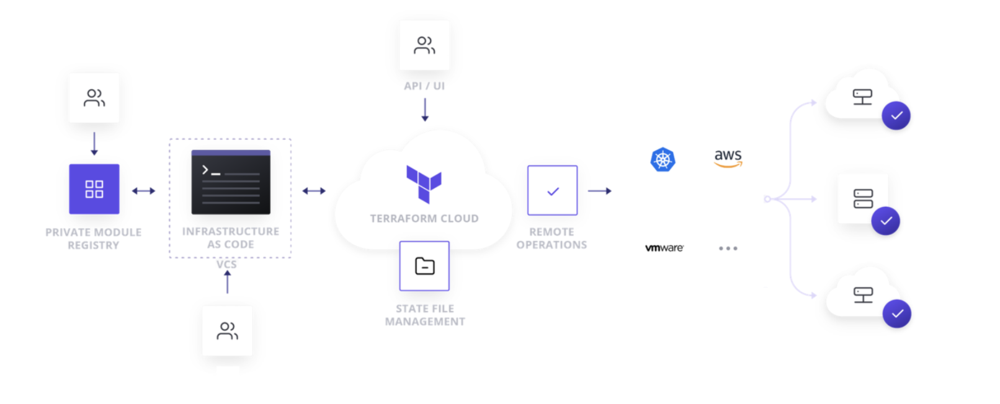
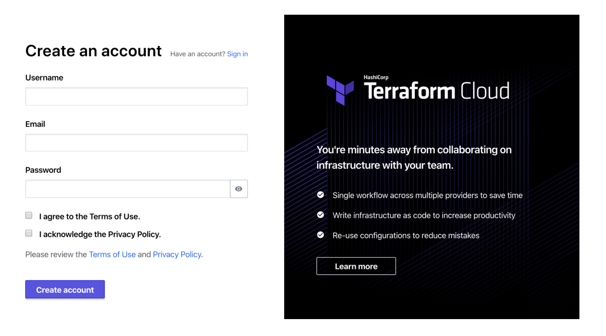
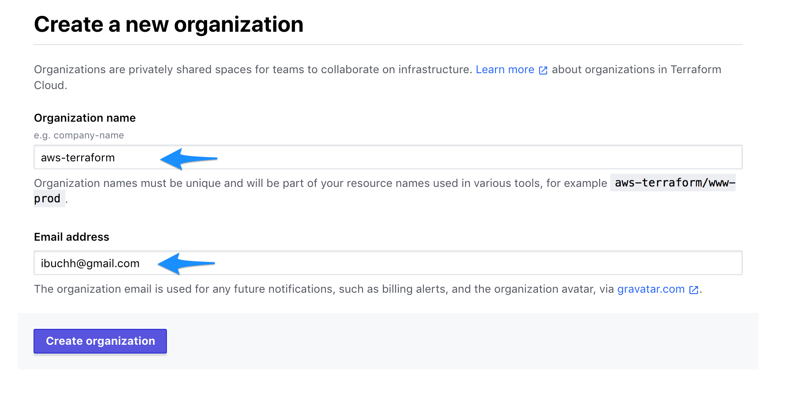
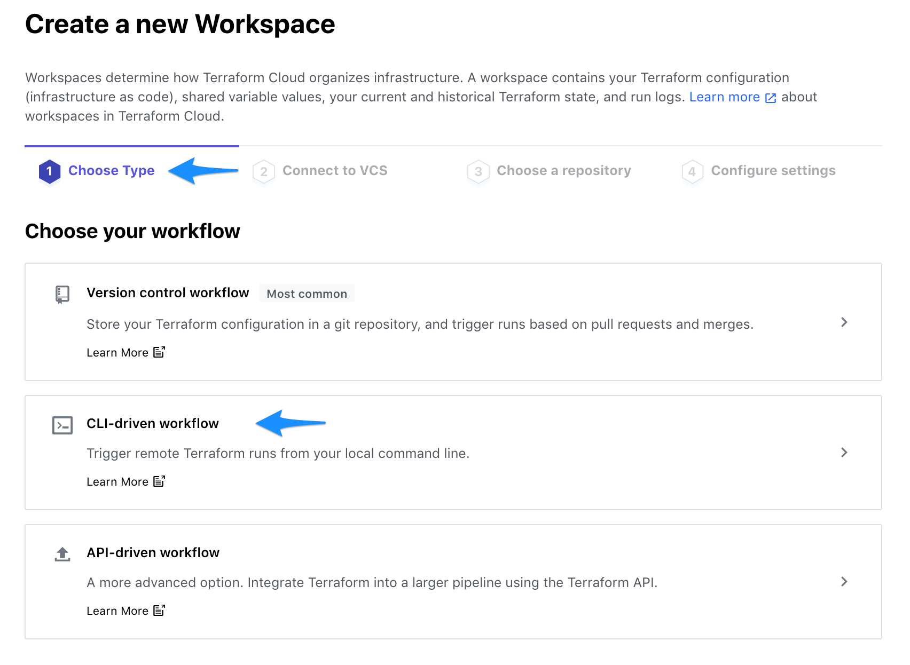
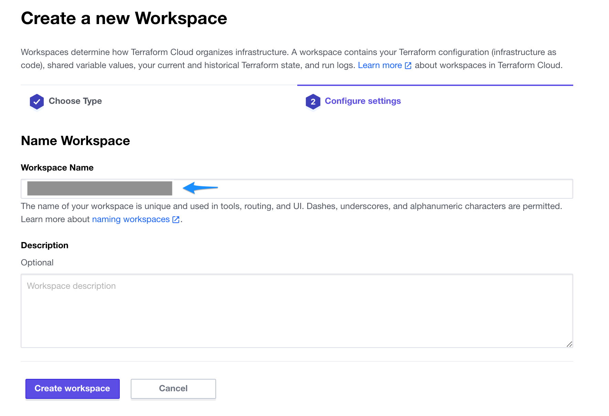
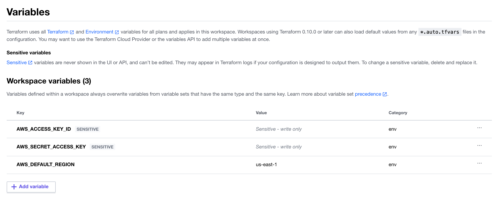

## MLOps
MLOps focuses on realizing the value from any data science activity through the adoption of DevOps and engineering best practices to build solutions and products that have an ML component at their core. It provides the standards, tools, and framework that supports the work of data science teams to take their ideas from the whiteboard to production in a timely, secure, traceable, and repeatable manner. 

## Benefits
With this MLOps architecture, AWS partners can enable their customers to accelerate operationalizing ML models in production to achieve the benefits of an automated machine learning lifecycle management by reducing the typical lifecycle for a significantly faster delivery time.

## Background
The solutions architecture here was made to address a particular use-case (people analytics attrition model) but the intention was to design it in such a way that it can be used generically across different ML problems. Of course, this will not meet all ML use-case requirements but many of the components are key to almost all ML systems in AWS (S3 storage, SageMaker hyperparameter tuning, training, and deployment). This is intended to be a starting point for establishing proper ML pipeline automation with many re-usable elements that can form the foundation for a mature ML system.

## Use Case
This architecture describes using machine learning (ML) for the automated identification of unhappy customers, also known as customer churn prediction. Losing customers is costly for any business, so identifying unhappy customers early on gives you a chance to offer them incentives to stay.  

We shall use a familiar example of churn: leaving a mobile phone operator. And if the provider knows that a customer is thinking of leaving, it can offer timely incentives - such as a phone upgrade or perhaps having a new feature activated – and the customer may stick around. Incentives are often much more cost-effective than losing and reacquiring a customer.

## Solution Architecture


The architecture shown above is an example of an automated MLOps pipeline could look like in AWS. This is for a batch inference model deployment where a persistent endpoint is not required (although it is optionally available as part of the infrastructure build). It uses a serverless architecture which has benefits in terms of cost-efficiency and ease of development. 

The key AWS services are:

* **AWS CodePipeline** automates your software release process, allowing you to rapidly release new features to your users. With CodePipeline, you can quickly iterate on feedback and get new features to your users faster.
* **AWS CodeBuild** eliminates the need to set up, patch, update, and manage your own build servers and software. There is no software to install or manage.
* **Amazon S3** for initial data storage/data lakes, storing flat-file data extracts, source code, model objects, inference output, and metadata storage.
* **Amazon SageMaker** Amazon SageMaker helps you streamline the machine learning (ML) lifecycle by automating and standardizing MLOps practices across your organization. You can easily build, train, deploy, and manage ML models, whether it’s only a few, hundreds of thousands, or even millions. With purpose-built tools for ML lifecycle management and built-in integrations with other AWS services, you can boost productivity of data scientists and ML engineers while maintaining high model accuracy and enhancing security and compliance.
* **Amazon CloudWatch** for monitoring SageMaker tuning and training jobs.

## Why Terraform
We have received a lot of feedback from a number of AWS Strategic partners and customers about their MLOps use cases and discovered that they are using Terraform for their infrastructure automation. As a result of this feedback, we decided to use Tarraform to help them in their efforts. Here are additional reasons for using Terraform for MLOps use cases:
* Terraform can define infrastructure and manage infrastructures’ lifecycle directly. To use SageMaker Studio project, a project template should be created in advance and saved in Service Catalog. The template needs to define infrastructure using CloudFormation.
* Terraform supports multi-cloud platforms. User can provision services on multiple cloud platform.
* Terraform has workspaces, which makes it easier to manage multiple environments.
* Using Terraform can expedite deployment process because development team lacks skills and experiences in CloudFormation.   

## Setup Terraform Cloud
Terraform Cloud is an application that manages Terraform runs in a consistent and reliable environment instead of on your local machine. It stores shared state and secret data, and connects to version control systems so that you and your team can work on infrastructure as code within your usual code workflow. It also has a private registry for sharing Terraform modules.



### Create an account

Visit https://app.terraform.io/signup/account and follow the prompts to create a free Terraform Cloud account.



When you sign up, you'll receive an email asking you to confirm your email address. Confirm your email address before moving on.

### Create an organization

After you create your account, the Terraform Cloud Web UI will prompt you to create a new organization. Your organization is free, and the members you add will be able to collaborate on your workspaces and share private modules.

Enter aws-terraform as organization name and an email address. You can use the same email address that you used for your account.



### Create a workspace

Workspaces determine how Terraform Cloud organizes infrastructure. 



Click CLI-driven workflow.



Enter **aws-terraform-lambda-container** as the Workspace Name and click **Create workspace**.


Copy the Example code and paste it inside the provider.tf file.

### Configure AWS credentials

Click the **Variables** tab at the top to create **Terraform Variables** AWS_REGION and **Environment Variables** AWS_ACCESS_KEY_ID, AWS_SECRET_ACCESS_KEY.



### Terraform login

Using Cloud9 environment, open a new Terminal and use the following command:

```bash
terrafom login
```
At the prompt, enter yes and follow the instructions to generate a token using the url : https://app.terraform.io/app/settings/tokens?source=terraform-login.

Terraform will store the token in this file: 
```bash
/home/ec2-user/.terraform.d/credentials.tfrc.json
```

<!--  -->

## Provision infrastructure using Terraform Cloud

### Terraform CLI

Inside the Cloud9 terminal run:

```bash
cd ~/environment/aws-terraform-lambda-container/terraform
terraform init
```
<!--  -->

```bash
terraform plan
terraform apply
```

<!--  -->

<!-- Here are the results of the **terraform apply** -->

<!--  -->

In order to cleanup the resources, run the following command:

```bash
terraform destroy
```
<!--  -->

Enter **yes** at the prompt.

<!--  -->

### Terraform Cloud UI

Login into your Terraform Cloud UI using your account at : https://app.terraform.io

From the **Queue plan** drop down, click **Queue plan** button.

<!--  -->

Click **Confirm & Apply**.

<!--  -->

Add a comment to explain this action and then click **Confirm Plan** button.

<!--  -->
